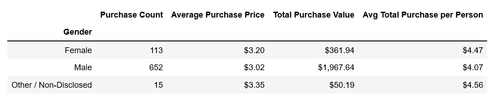
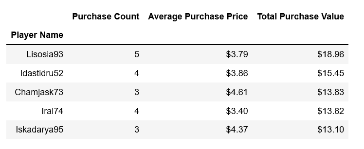
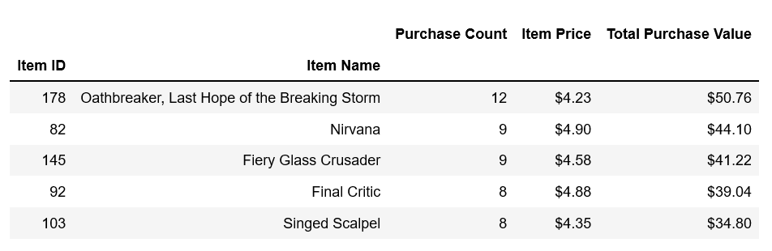

# Home Work Assignment - The VBA of Wall Street

## Assignment Scope

* Analyzing the purchase data for the fantasy game Heroes of Pymoli.

### Total Number of Players

### Purchasing Analysis (Total)

### Gender Demographics

### Purchasing Analysis (Gender)

### Age Demographics

### Purchasing Analysis (Age Group)

### Top Spenders

### Most Popular Items

### Most Profitable Items

