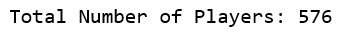
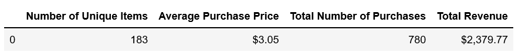
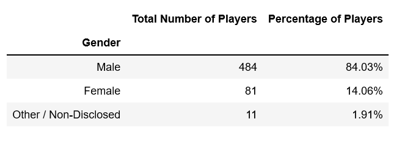
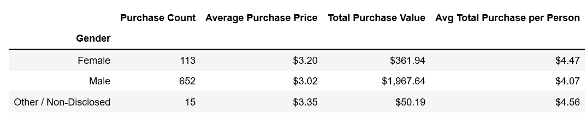
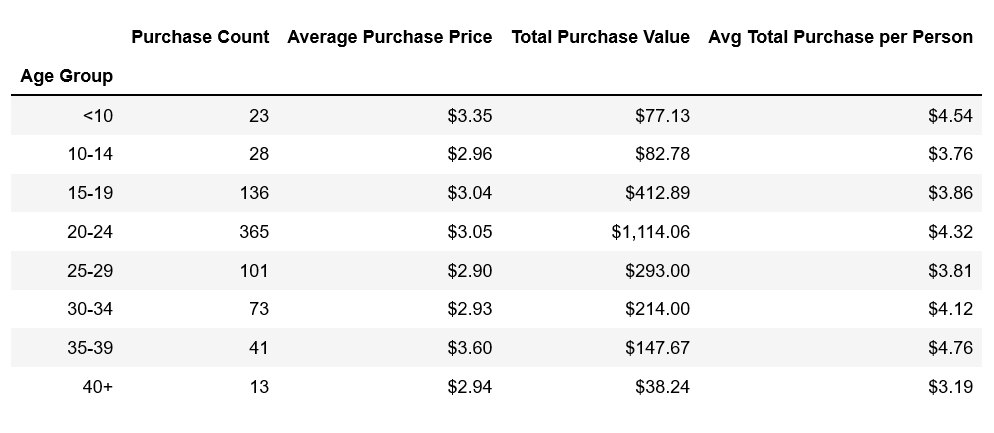
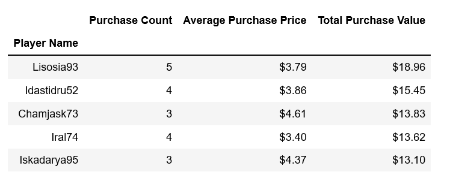
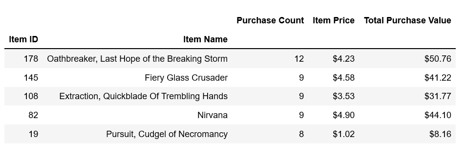
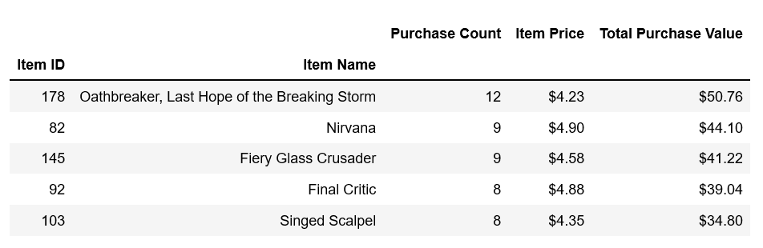

# Home Work Assignment - Pandas - Final Report

## Assignment Scope

* Analyzing the purchase data for the fantasy game Heroes of Pymoli.
* Complete the report with the, Total number of Players, Total Analysis, Demography based on Gender and Age, Purchasing data based on Gender and Age, Top Spender, Most popular Item and the most profitable item. 

### 1. Total Number of Players

### 2. Purchasing Analysis (Total)

### 3. Gender Demographics

### 4. Purchasing Analysis (Gender)

### 5. Age Demographics

### 6. Purchasing Analysis (Age Group)

### 7. Top Spenders

### 8. Most Popular Items

### 9. Most Profitable Items

## Observation
Based on the data Analysis, below are the observation / findings. 
* There are more Male players, considering 84 % of total players identified as Male. 
* Irrespective of the gender each player, on an average, spend between $4 to $4.5.
* Most Players are in the age group of 20 to 24 years.
* The most Popular and the most Profitable item is "Oathbreaker, Last Hope of the Breaking Storm", with "Nirvana" coming in the second Place. 

### Thank you 

This work is part of the `Pandas Homework assignment` by `UOM Data Analysis and Visualization Bootcamp`.

Submited by : Ganeshkumar Gurunathan
