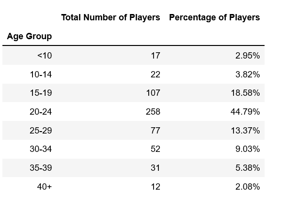

# Home Work Assignment - Pandas - Final Report

## Assignment Scope

* Analyzing the purchase data for the fantasy game Heroes of Pymoli.

### Total Number of Players

### Purchasing Analysis (Total)

### Gender Demographics

### Purchasing Analysis (Gender)

### Age Demographics

### Purchasing Analysis (Age Group)

### Top Spenders

### Most Popular Items

### Most Profitable Items

## Observation
Based on the data Analysis, below are the observation / findings. 
* There are more Male players, considering 84 % of total players identified as Male. 
* Irrespective of the gender each player, on an average, spend between $4 to $4.5.
* Most Players are in the age group of 20 to 25 years.
* The most Popular and the most Profitable item is "Oathbreaker, Last Hope of the Breaking Storm", with "Nirvana" coming in the second Place. 

### Thank you 

This work is part of the `Pandas Homework assignment` by `UOM Data Analysis and Visualization Bootcamp`.

Submited by : Ganeshkumar Gurunathan
